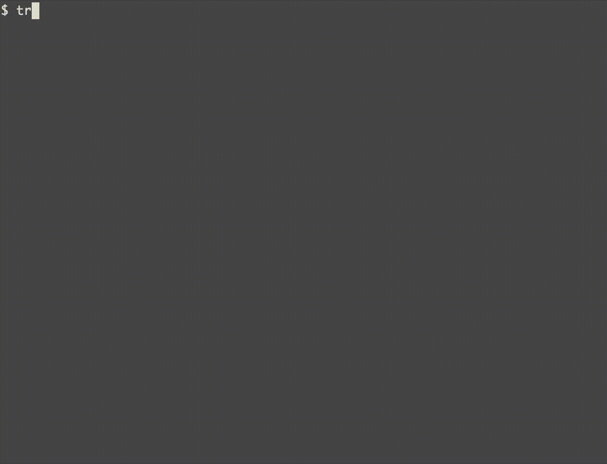

# treetop

Treetop is a fast, animated "disk summarizer."

Essentially, a replacement for

    du -ks * | sort -rn

... but animated, so you can get progressive
feedback while your disk is being scanned
(helpful for very large directories).

# Install

Install [Go](https://go.dev/), then

    go get github.com/eigenhombre/treetop

# Examples

    treetop    # Shows current directory usage
    treetop ~  # Shows home directory usage

